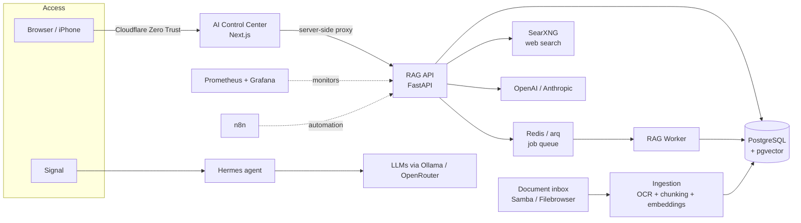

# AI Knowledge Platform on a €300 Server

> A self-hosted AI platform covering knowledge bases, semantic search, web research, chat and a multi-agent assistant. It runs 24/7 on a mini PC with production-style security, monitoring and a hard cost budget.

**Author:** Daniel Strobel · Account Management & Customer Success leader building practical AI
**Status:** In daily use since July 2026 · actively developed

> ℹ️ This repository is a **case study**. The working code lives in a private repository because it contains infrastructure details. I'm happy to walk through it in an interview.

---

## Why I built this

Companies want to use AI on their own documents, but they run into the same questions every time:

- *Will our data stay under our control?*
- *What will this cost, and who stops it from running away?*
- *Can we trust the answers, and can we see where they come from?*
- *Who maintains it when the person who set it up is gone?*

I wanted to answer those questions in practice, not on slides. So I built the whole stack myself on deliberately modest hardware: a **€300 mini PC** with an Intel Celeron and 7 GB RAM.

## What it does

| Module | What it does | Why it matters |
|---|---|---|
| **Knowledge bases** | Drop documents into a folder and each top-level folder becomes its own knowledge base automatically. OCR, chunking and embeddings run every 15 minutes. | Zero configuration for users. Departments or clients stay separated. |
| **Semantic search** | Search across one, several or all knowledge bases, with filters and source references. | Answers are traceable to the original document. |
| **Research** | Prompt → web search → fetch sources → summarize → **one** LLM synthesis with numbered citations. | Deliberately *not* an autonomous agent: predictable, auditable, cheap. |
| **Chat** | ChatGPT-style chat with streaming, conversation history, model choice (OpenAI / Anthropic) and a RAG mode that answers only from your knowledge bases. | Feature parity with Open WebUI, verified against a checklist. |
| **AI Control Center** | Web UI for dashboard, uploads, search debugging, research, chat and live system KPIs. | A single interface for non-technical users. |
| **Hermes agent** | Personal assistant controlled via **Signal** messages and reachable from Mac and iPhone over a private network. Being extended into multiple specialized agents, each with its own model. | Shows multi-agent orchestration with mixed models. |

## Architecture

## Design decisions I'm proud of

**1. A cost budget that cannot be bypassed.**
Every paid AI call (embeddings, search, research, chat) is written to one shared cost ledger with **per-run, daily and monthly limits**. If a limit is reached, the job stops *before* the first paid call. The default provider is a free mock, and real models are switched on deliberately. Example: a full end-to-end research run cost **$0.00011**.

**2. Security by default, not by afterthought.**
- No open router ports. External access goes only through Cloudflare Zero Trust, and the agent is reachable only over a private Tailscale network.
- The API fails closed. API keys stay server-side and never reach the browser bundle (verified).
- Each service gets its **own low-privilege database role**, and no container gets Docker-socket access.
- Web research is protected against SSRF with real IP pinning, which prevents DNS-rebinding tricks.
- The agent only accepts commands from one allow-listed Signal number.

**3. A human stays in the loop where it matters.**
Research reports never enter a knowledge base automatically. There is one explicit approval endpoint, with a confirmation dialog in the UI.

**4. Built for the next person.**
Architecture decision records (ADRs), a disaster-recovery guide, an update procedure (`make update`), daily, weekly and monthly backups, and a full service inventory. The goal is that anyone can rebuild the server from the documentation alone.

**5. Tested against reality.**
169 backend and 36 frontend tests (Vitest, Playwright E2E), plus live verification against the real infrastructure after every phase.

## Tech stack

`Python` · `FastAPI` · `PostgreSQL + pgvector` · `Redis / arq` · `Next.js` · `Docker Compose` · `Tesseract OCR` · `OpenAI text-embedding-3-small` · `OpenAI & Anthropic APIs` · `SearXNG` · `Prometheus` · `Grafana` · `n8n` · `Cloudflare Zero Trust` · `Tailscale` · `Ollama` · `Hermes Agent` · `Ubuntu Server`

## How I built it

I built this in phases (data layer → ingestion → embeddings → search → API → UI → jobs → monitoring → research → chat). Each phase had a written plan, an acceptance checklist and an ADR. I used **AI coding assistants (Claude Code) as a pair programmer**, while owning the architecture, the security and cost decisions, and the verification myself.

This is how I'd approach AI adoption in a company: start small, put guardrails in place first, prove value step by step, and document so others can take over.

## What this means for a business

- **Data control:** Self-hosting is realistic even on minimal hardware.
- **Cost control:** AI spend can be capped and made transparent from day one.
- **Trust:** Source citations and approval gates make AI output auditable.
- **Adoption:** A single, simple UI and zero-config knowledge bases lower the barrier for non-technical teams.

## Roadmap

- [ ] Specialized agents (code, research, architecture) with their own model each, talking to each other
- [ ] Local embeddings / LLMs as an alternative to cloud APIs
- [ ] Multi-user access control per knowledge base
- [ ] PII pseudonymization before data reaches external models

---

📫 **Contact:** [LinkedIn](https://www.linkedin.com/in/danielstrobel/)
